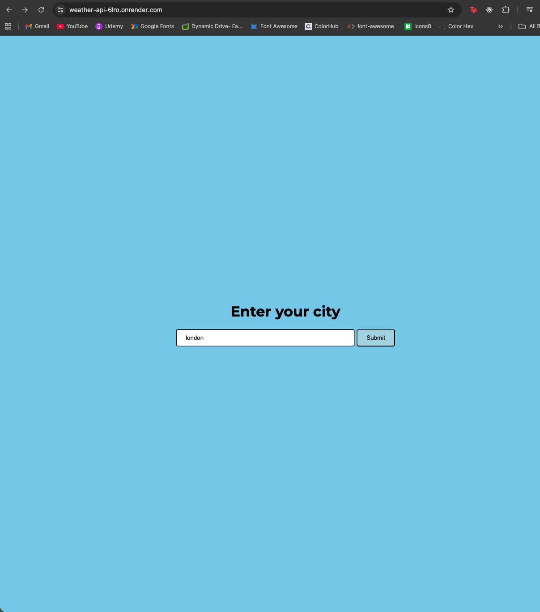
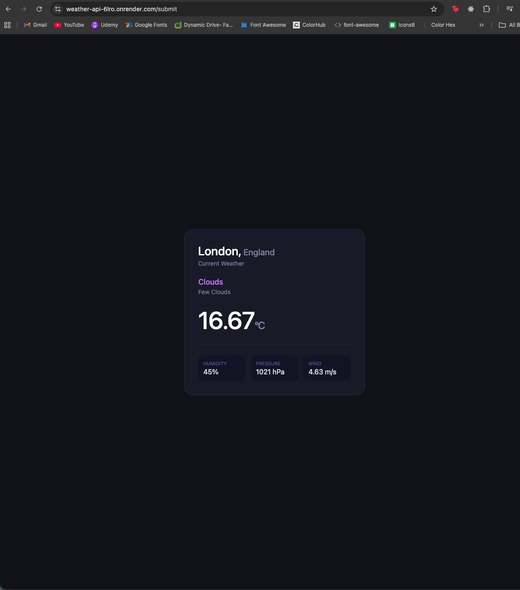

🌤️ Weather API App

Node.js | Express | EJS | API Integration

A server-side rendered weather application that fetches real-time weather data from an external API and displays it dynamically to users.

This project was built to strengthen my understanding of backend development, API handling, and dynamic rendering using EJS.

🔍 About This Project
Built with Node.js, Express, and EJS
Fetches live weather data from an external API
Demonstrates async/await, routing, and server-side rendering
Focused on improving backend logic and real-world API usage

🚀 Live Demo
https://weather-api-6lro.onrender.com

🧠 What I Learned
How to integrate external APIs into a Node.js application
Handling asynchronous requests using async/await
Parsing JSON data and passing it into EJS templates
Managing routes and user input in Express
Handling errors (e.g. invalid city names, failed API calls)
Using environment variables to secure API keys

🛠️ Tech Stack
Backend
Node.js
Express.js
EJS (Templating)
Frontend
HTML
CSS
Other Tools
REST API
Git & GitHub
Render (Deployment)
dotenv

⚙️ Features
Search for any city’s weather
Dynamic rendering of API data
Clean server-side routing
Error handling for invalid input
Simple and functional UI

📸 Screenshots

🧪 Installation
git clone https://github.com/Baffyy/weather-app.git
cd weather-app
npm install
node index.js

🔐 Environment Variables
Create a .env file in the root:
API_KEY=your_api_key_here

📈 Future Improvements
Add 5-day / weekly forecast
Improve UI/UX design
Add loading states and animations
Convert frontend to React
Add geolocation-based weather
📌 Project Status

✅ Completed core functionality
🔄 Iterating and improving features

🔗 Links

GitHub Repo: https://github.com/Baffyy/weather-app

Live App: https://weather-api-6lro.onrender.com/
